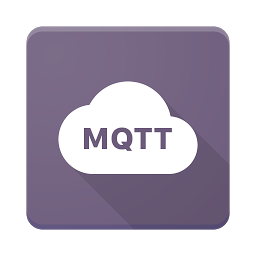

# gpio-to-mqtt

  

A simple project for translating changes to Raspberry Pi GPIO pins to MQTT messages written in Go.

This project can be handy for anything where a GPIO pin will be turned on/off and you’d like to notify listeners on your network of the change. A good example is wiring a Raspberry Pi up to door and window switches from an old alarm system to notify listeners on your network of changes. Someone opens or closes a window? You’ll get an MQTT message.

## Getting Started

This project is written in Go so you’ll need to install go on your Raspberry Pi by running:

> sudo apt-get install golang

That should get your running with Go. Then you will need to configure your Go environment by creating your Go directories and setting your $GOPATH.

Once that’s done, you can clone the repo into your source directory and run:

> go get
> go install

This will get the dependencies and install in your bin directory. Now you need a configuration file.

## Configuration

By default, gpio-to-mqtt will look in the directory it was launched from for a *.config* file if one was not specified as the first command line argument. A sample is provided in the root of the project titled *config.default.json.*

Options within this file include:

```json
{
  "PollingIntervalMs": 500,
  "MQTT": {
    "Broker": "127.0.0.1",
    "Port": 1883
  },
 "Pins": [{
   "GPIOPin": 22,
   "Topic": "downstairs/frontdoor",
   "Pull": 2,
   "Name": "Front Door",
   "Retain": true
 }]
}
```

You can define as many additional pins as your board supports by just adding to the pins array in the configuration file.

### Configuration Options

- **PollingIntervalMs:** The frequency with which to check for pin state changes in milliseconds.
- **MQTT.Broker:** The MQTT broker host name or ip.
- **MQTT.Port:** The MQTT broker listening port.
- **Pins[].GPIOPin:** The GPIO pin number to monitor (NOT the BCM pin number).
- **Pins[].Topic:** The topic to broadcast the state change message to.
- **Pins[].Pull:** Whether to pull up (2), down (1), or off (0).
- **Pins[].Name:** A friendly name for the pin.
- **Pins[].Retain:** Whether the broker should retain state change messages.
